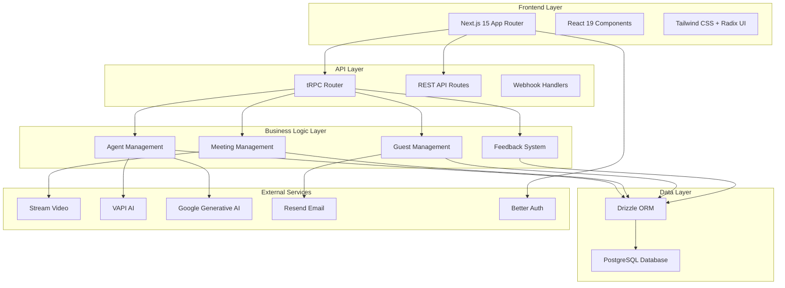

# Meet-Me Project Report

## Executive Summary

Meet-Me is a Next.js-based web application that enables users to create and manage AI-powered agents for video meetings. The platform integrates VAPI AI for conversational AI agents and Stream Video for real-time video conferencing, providing a comprehensive solution for intelligent meeting management.

The application demonstrates solid architectural foundations with modern web technologies, though there are opportunities for code quality improvements and additional features.

## Project Status Report

### Current Features

#### ✅ Implemented Features

**Core Functionality:**
- User authentication and authorization (Better Auth)
- AI Agent management (CRUD operations)
- Meeting scheduling and lifecycle management
- Real-time video conferencing (Stream Video integration)
- AI agent participation in meetings (VAPI integration)
- Guest invitation and management
- Meeting recording and transcription
- Automatic email notifications to guests
- User feedback collection system

**Technical Infrastructure:**
- Next.js 15 with App Router
- TypeScript for type safety
- PostgreSQL database with Drizzle ORM
- tRPC for type-safe API communication
- Tailwind CSS for styling
- Radix UI component library

#### 🚧 Partially Implemented Features

**Meeting Management:**
- Meeting status tracking (upcoming, active, completed, cancelled, processing)
- Automatic meeting lifecycle management via webhooks
- Recording and transcription URL storage

**Integration Features:**
- Stream Video webhook handling for meeting events
- VAPI AI integration for agent participation
- Email notifications with Resend

#### 📋 Planned/Missing Features

**User Experience:**
- Meeting summary generation
- Advanced agent customization options
- Meeting analytics and insights
- Mobile-responsive design improvements

**Technical Enhancements:**
- Comprehensive error handling and logging
- Automated testing suite
- Performance monitoring and optimization
- API rate limiting and security enhancements

### Development Status

**Current Version:** 0.1.0 (Beta)

**Codebase Health:**
- **Lines of Code:** ~15,000+ (estimated)
- **Test Coverage:** 0% (no tests implemented)
- **Documentation:** Comprehensive (this report + user docs)
- **Dependencies:** 58 production, 11 development

**Known Issues:**
- Inconsistent component naming conventions
- Some commented-out code blocks
- Limited error handling in edge cases
- No automated testing
- Performance optimization opportunities

## Architecture Review and Design Decisions

### System Architecture

### Design Decisions Analysis

#### ✅ Good Design Decisions

**1. Technology Stack Selection:**
- **Next.js 15 + App Router:** Modern, performant framework with excellent developer experience
- **TypeScript:** Provides compile-time type checking and better IDE support
- **tRPC:** Type-safe API layer eliminates common API-related bugs
- **Drizzle ORM:** Type-safe database operations with excellent developer experience
- **Tailwind + Radix UI:** Consistent, accessible component system

**2. Modular Architecture:**
- Feature-based code organization (`src/modules/`)
- Clear separation of concerns (UI, server logic, database)
- Reusable component library structure
- Well-defined API boundaries

**3. External Service Integration:**
- Proper abstraction of third-party services
- Webhook-based event handling for real-time updates
- Graceful error handling for external service failures

#### ⚠️ Questionable Design Decisions

**1. Component Naming Inconsistencies:**
- Mixed naming conventions (`componenets` vs `components`)
- Inconsistent file naming patterns
- **Impact:** Reduces code readability and maintainability

**2. Database Schema Design:**
- Meeting status as enum is good, but limited flexibility
- No soft deletes or audit trails
- **Recommendation:** Consider adding `deletedAt` fields for data recovery

**3. Error Handling:**
- Inconsistent error handling patterns across modules
- Some endpoints lack proper validation
- **Impact:** Poor user experience during failures

#### ❌ Poor Design Decisions

**1. Code Comments and Dead Code:**
- Extensive commented-out code blocks
- TODO comments without implementation
- **Impact:** Code clutter, confusion for new developers

**2. Function Complexity:**
- Some functions exceed 100+ lines (e.g., webhook handler)
- Mixed responsibilities within single functions
- **Impact:** Difficult to test and maintain

**3. Missing Abstractions:**
- Direct database queries in API routes
- Repeated patterns without shared utilities
- **Impact:** Code duplication and maintenance burden

## Technical Analysis Report

### Code Quality Assessment

#### Strengths

**1. Type Safety:**
- Comprehensive TypeScript usage
- tRPC provides end-to-end type safety
- Drizzle ORM ensures database type safety
- **Score: 9/10**

**2. Modern React Patterns:**
- Proper use of hooks and suspense
- Component composition patterns
- Clean separation of concerns
- **Score: 8/10**

**3. Database Design:**
- Well-normalized schema
- Proper foreign key relationships
- Efficient querying with joins
- **Score: 8/10**

#### Weaknesses

**1. Code Organization:**
- Inconsistent naming conventions
- Mixed file structures
- Dead code presence
- **Score: 5/10**

**2. Error Handling:**
- Inconsistent error patterns
- Limited edge case handling
- Poor error messages for users
- **Score: 4/10**

**3. Testing:**
- No automated tests
- No integration test setup
- Manual testing only
- **Score: 1/10**

**4. Performance:**
- No caching strategies
- Potential N+1 query issues
- Large bundle sizes possible
- **Score: 5/10**

#### Security Assessment

**Strengths:**
- Proper authentication with Better Auth
- Input validation with Zod schemas
- Webhook signature verification
- Environment variable configuration

**Concerns:**
- No rate limiting on API endpoints
- Limited input sanitization
- No API versioning strategy
- CORS configuration not visible

**Security Score: 6/10**

### Performance Analysis

#### Current Performance Characteristics

**1. Frontend Performance:**
- Next.js provides good defaults
- Suspense for loading states
- Potential bundle size optimization needed

**2. Database Performance:**
- Drizzle ORM generates efficient queries
- Proper indexing assumed (not verified)
- Some complex queries with joins

**3. API Performance:**
- tRPC batching capabilities
- No caching implemented
- Synchronous operations in webhooks

#### Performance Bottlenecks

1. **Webhook Processing:** Synchronous database operations during webhooks
2. **Query Efficiency:** Potential N+1 queries in meeting listings
3. **Bundle Size:** No code splitting analysis performed
4. **Image Optimization:** Avatar generation on-demand

### Scalability Assessment

#### Current Scalability

**Strengths:**
- Stateless API design
- Database connection pooling (assumed)
- Horizontal scaling potential with Next.js

**Limitations:**
- Single database instance
- No caching layer
- Synchronous webhook processing
- No background job processing

#### Scalability Recommendations

1. **Implement Redis for caching**
2. **Add background job processing (e.g., Bull.js)**
3. **Database read replicas**
4. **API rate limiting**
5. **CDN for static assets**

## Recommendations

### Immediate Actions (Priority 1)

**1. Code Quality Improvements:**
- Remove all commented-out code
- Standardize naming conventions
- Break down large functions (< 50 lines)
- Add comprehensive error handling

**2. Testing Implementation:**
- Set up Jest + React Testing Library
- Add unit tests for utilities
- Integration tests for API endpoints
- E2E tests for critical user flows

**3. Security Enhancements:**
- Implement rate limiting
- Add input sanitization
- Set up API versioning
- Add security headers

### Short-term Goals (1-3 months)

**1. Feature Completion:**
- Implement meeting summary generation
- Add advanced agent customization
- Improve mobile responsiveness
- Add meeting analytics

**2. Performance Optimization:**
- Implement caching strategies
- Optimize database queries
- Add code splitting
- Implement lazy loading

**3. Developer Experience:**
- Set up CI/CD pipeline
- Add code formatting (Prettier)
- Implement pre-commit hooks
- Add Storybook for components

### Long-term Vision (3-6 months)

**1. Advanced Features:**
- Multi-agent meetings
- Custom AI model integration
- Meeting templates
- Advanced analytics dashboard

**2. Platform Expansion:**
- Mobile app development
- API for third-party integrations
- White-label solutions
- Enterprise features

**3. Infrastructure Improvements:**
- Multi-region deployment
- Advanced monitoring (DataDog, Sentry)
- Auto-scaling configuration
- Disaster recovery planning

## Risk Assessment

### Technical Risks

**High Risk:**
- Single points of failure (database, external APIs)
- No automated testing increases bug likelihood
- Security vulnerabilities from untested code

**Medium Risk:**
- Performance degradation under load
- Scalability limitations
- Third-party service dependencies

**Low Risk:**
- Technology stack becoming outdated
- Team knowledge gaps

### Business Risks

**High Risk:**
- Incomplete feature set for beta release
- Poor user experience due to bugs
- Competition in AI meeting space

**Medium Risk:**
- Development timeline delays
- Budget overruns
- Team scalability

## Conclusion

Meet-Me demonstrates strong architectural foundations and innovative use of AI in video conferencing. The codebase shows good understanding of modern web development practices, with particular strength in type safety and API design.

However, significant improvements are needed in code quality, testing, and error handling to ensure production readiness. The recommended action plan provides a clear path forward to address these issues while continuing feature development.

The project has strong potential in the growing AI-powered collaboration space, with the current architecture providing a solid foundation for future growth and scaling.

---

**Report Generated:** October 8, 2025
**Version Analyzed:** 0.1.0
**Report Author:** AI Assistant
**Next Review Date:** November 8, 2025