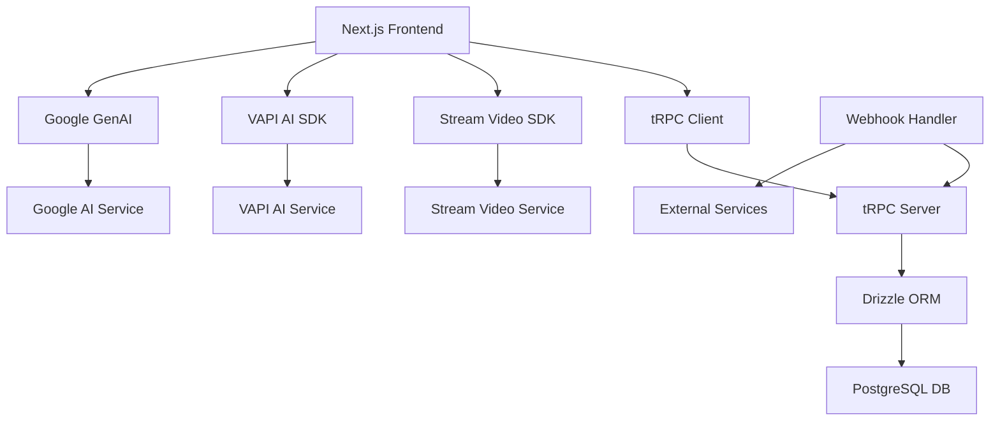

# Meet-Me Documentation

## Project Overview

Meet-Me is a Next.js-based web application that enables users to create and manage AI-powered agents for video meetings. The platform integrates with VAPI AI for conversational AI agents and Stream Video for real-time video conferencing, allowing users to host meetings with intelligent assistants that can participate in conversations, take notes, and provide summaries.

### Key Features

- **AI Agent Management**: Create, update, and manage custom AI agents with specific instructions
- **Video Meetings**: Host and join video meetings with integrated AI agents
- **Real-time Collaboration**: Stream Video integration for high-quality video calls
- **Meeting Summaries**: Automatic generation of meeting transcripts and summaries
- **Guest Management**: Invite guests to meetings without requiring accounts
- **Feedback System**: Collect user feedback and bug reports
- **Authentication**: Secure user authentication with Better Auth

### Technology Stack

- **Frontend**: Next.js 15, React 19, TypeScript, Tailwind CSS
- **Backend**: Next.js API routes, tRPC for type-safe APIs
- **Database**: PostgreSQL with Drizzle ORM
- **Authentication**: Better Auth
- **Video**: Stream Video React SDK
- **AI**: VAPI AI Web SDK, Google Generative AI
- **Email**: Resend for email services
- **UI Components**: Radix UI, Lucide React icons

### Project Structure

```
src/
├── app/                    # Next.js app router pages
│   ├── api/               # API routes
│   ├── (dashboard)/       # Dashboard layout and pages
│   └── ...
├── components/            # Reusable UI components
├── db/                    # Database schema and connection
├── hooks/                 # Custom React hooks
├── lib/                   # Utility libraries and configurations
├── modules/               # Feature modules (agents, meetings, etc.)
│   ├── agents/
│   ├── meetings/
│   ├── feedback/
│   └── ...
├── trpc/                  # tRPC configuration and routers
└── ...
```

## Setup and Installation

### Prerequisites

- Node.js 18+
- PostgreSQL database
- API keys for:
  - Stream Video
  - VAPI AI
  - Google Generative AI
  - Resend (for emails)

### Installation

1. Clone the repository:
```bash
git clone <repository-url>
cd meet-me
```

2. Install dependencies:
```bash
npm install
```

3. Set up environment variables:
Create a `.env.local` file with the following variables:
```env
DATABASE_URL=postgresql://...
STREAM_SECRET_KEY=...
VAPI_API_KEY=...
GOOGLE_GENAI_API_KEY=...
RESEND_API_KEY=...
NEXTAUTH_SECRET=...
NEXTAUTH_URL=http://localhost:3000
```

4. Set up the database:
```bash
npm run db:push
```

5. Start the development server:
```bash
npm run dev
```

Open [http://localhost:3000](http://localhost:3000) to view the application.

## Architecture



### Data Flow

1. Users authenticate via Better Auth
2. Agents are created and stored in the database
3. Meetings are scheduled with associated agents
4. During meetings, Stream Video handles real-time video
5. VAPI AI processes audio and generates responses
6. Meeting data is transcribed and summarized
7. Webhooks handle external integrations

## Database Schema

The application uses PostgreSQL with the following main tables:

### Users and Authentication
- `user`: User accounts with profile information
- `session`: User sessions for authentication
- `account`: OAuth provider accounts
- `verification`: Email verification tokens

### Core Entities
- `agents`: AI agents with instructions and user ownership
- `meetings`: Meeting records with status, timing, and media URLs
- `guests`: Guest participants for meetings
- `feedback`: User feedback and bug reports

### Relationships
- Users can have multiple agents and meetings
- Meetings belong to users and are associated with one agent
- Guests are linked to specific meetings
- Feedback can be anonymous or user-associated

## API Documentation

### tRPC Endpoints

The application uses tRPC for type-safe API communication. All endpoints require authentication unless specified otherwise.

#### Agents API

**Base Path:** `api/trpc/agents`

##### Create Agent
- **Endpoint:** `agents.create`
- **Method:** Mutation
- **Input:**
  ```typescript
  {
    name: string;
    instruction: string;
  }
  ```
- **Output:** Created agent object
- **Description:** Creates a new AI agent for the authenticated user

##### Get Agents
- **Endpoint:** `agents.getMany`
- **Method:** Query
- **Input (optional):**
  ```typescript
  {
    limit?: number; // 1-100, default 10
    offset?: number; // default 0
    search?: string; // Search by name
  }
  ```
- **Output:**
  ```typescript
  {
    items: Agent[];
    total: number;
    totalPages: number;
  }
  ```

##### Get Single Agent
- **Endpoint:** `agents.getOne`
- **Method:** Query
- **Input:** `{ id: string }`
- **Output:** Agent object or 404 error

##### Update Agent
- **Endpoint:** `agents.update`
- **Method:** Mutation
- **Input:** Agent update data with ID
- **Output:** Updated agent object

##### Delete Agent
- **Endpoint:** `agents.remove`
- **Method:** Mutation
- **Input:** `{ id: string }`
- **Output:** Deleted agent object

#### Meetings API

**Base Path:** `api/trpc/meetings`

##### Create Meeting
- **Endpoint:** `meetings.create`
- **Method:** Mutation
- **Input:**
  ```typescript
  {
    name: string;
    agentId: string;
    startTime?: Date;
    // ... other fields
  }
  ```
- **Output:** Created meeting object

##### Get Meetings
- **Endpoint:** `meetings.getMany`
- **Method:** Query
- **Input:** Pagination and filter options
- **Output:** Paginated meeting list

##### Update Meeting Status
- **Endpoint:** `meetings.updateStatus`
- **Method:** Mutation
- **Input:** `{ id: string; status: MeetingStatus }`
- **Output:** Updated meeting

#### Feedback API

**Base Path:** `api/trpc/feedback`

##### Submit Feedback
- **Endpoint:** `feedback.create`
- **Method:** Mutation
- **Input:**
  ```typescript
  {
    rating: number; // 1-5
    comment?: string;
    bugReport?: string;
  }
  ```
- **Output:** Created feedback object

##### Get Feedback
- **Endpoint:** `feedback.getMany`
- **Method:** Query
- **Input:** Pagination options
- **Output:** Feedback list (admin only)

### REST API Endpoints

#### Webhook Handler
- **Path:** `api/webhook`
- **Method:** POST
- **Description:** Handles webhooks from external services (VAPI, Stream, etc.)
- **Body:** Webhook payload
- **Response:** Success confirmation

#### Transcript API
- **Path:** `api/transcript/[meetingId]`
- **Method:** GET
- **Description:** Retrieves meeting transcript
- **Response:** Transcript data or 404

#### Guest Meeting API
- **Path:** `api/guest-meeting/[meetingId]`
- **Method:** GET
- **Description:** Provides meeting info for guests
- **Response:** Meeting details for guest access

#### VAPI Test API
- **Path:** `api/test-vapi`
- **Method:** POST
- **Description:** Test VAPI AI integration
- **Body:** Test parameters
- **Response:** Test results

## Key Components

### Authentication Components
- `SignInView`: User login form
- `SignUpView`: User registration form
- `EmailConfirmation`: Email verification component

### Dashboard Components
- `DashboardSidebar`: Navigation sidebar
- `DashboardNavbar`: Top navigation bar
- `DashboardUserButton`: User menu

### Agent Management
- `AgentViews`: Agent list and management
- `AgentForms`: Create/edit agent forms
- `AgentIdView`: Individual agent details

### Meeting Components
- `MeetingsView`: Meeting list
- `MeetingIdView`: Meeting details and controls
- `JoinMeetingView`: Join meeting interface
- `CallView`: Active call interface with video

### Call Components
- `CallActive`: Active call state
- `CallChat`: In-call chat
- `CallLobby`: Pre-call waiting room
- `CallEnded`: Post-call summary

### UI Components
- `DataTable`: Reusable data table with sorting/filtering
- `ResponsiveDialog`: Mobile-friendly dialogs
- `EmptyState`: Empty state displays
- `LoadingState`: Loading indicators
- `ErrorState`: Error handling displays

## Usage Guide

### For Users

1. **Sign Up/Login**: Create an account or sign in
2. **Create Agent**: Go to Agents page, create a new AI agent with instructions
3. **Schedule Meeting**: Create a meeting and assign an agent
4. **Invite Guests**: Add guest emails to the meeting
5. **Join Meeting**: Use the meeting link to join
6. **During Meeting**: The AI agent will participate based on instructions
7. **Post-Meeting**: View transcript and summary

### For Developers

1. **Environment Setup**: Configure all required API keys
2. **Database Migration**: Run `npm run db:push` after schema changes
3. **API Integration**: Use tRPC client for type-safe API calls
4. **Component Development**: Follow the modular structure in `src/modules/`
5. **Styling**: Use Tailwind CSS classes and component variants

## Troubleshooting

### Common Issues

#### Database Connection Errors
- **Symptom:** Application fails to start with DB errors
- **Solution:** Check `DATABASE_URL` in `.env.local`, ensure PostgreSQL is running

#### Authentication Issues
- **Symptom:** Users can't sign in
- **Solution:** Verify `NEXTAUTH_SECRET` and OAuth provider configurations

#### Video Call Problems
- **Symptom:** Video doesn't load or is distorted
- **Solution:** Check Stream Video API keys, ensure HTTPS in production

#### AI Agent Not Responding
- **Symptom:** Agent doesn't participate in calls
- **Solution:** Verify VAPI API key, check agent instructions, ensure proper webhook setup

#### Build Errors
- **Symptom:** `npm run build` fails
- **Solution:** Check for TypeScript errors, ensure all dependencies are installed

### Debug Mode

Enable debug logging by setting:
```env
NODE_ENV=development
```

### Webhook Debugging

Webhooks can be tested using tools like ngrok:
```bash
npm run hook
```

### Performance Issues

- Monitor database query performance with Drizzle's query logging
- Use React DevTools to identify component re-renders
- Check network tab for slow API calls

### Getting Help

- Check the issues section on GitHub
- Review the code comments for implementation details
- Use the feedback system in the app to report bugs

## Contributing

1. Fork the repository
2. Create a feature branch
3. Make changes with proper TypeScript types
4. Add tests if applicable
5. Submit a pull request

## License

This project is licensed under the MIT License - see the LICENSE file for details.